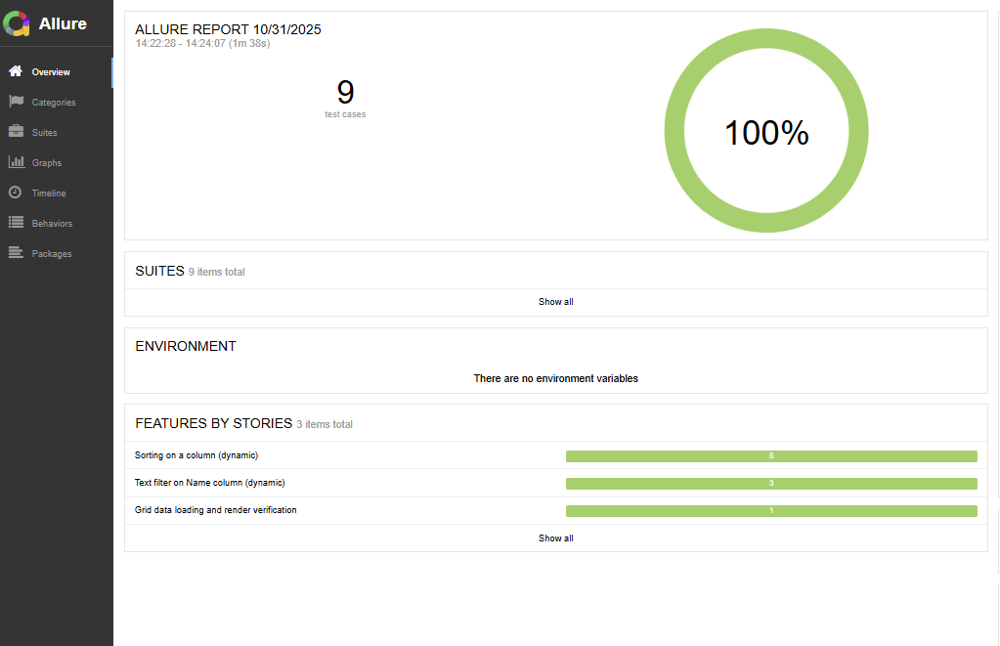

# 🧪 Huseyin Ozdemir-Biobank AG Grid – Playwright + Cucumber Test Framework

This repository is a test automation project for the AG Grid “Performance” demo, built with Playwright and Cucumber.js. It includes Allure integration for rich, interactive reporting, plus failure screenshots.

---

## 📁 Folder Structure

```
biobank_Huseyin_Ozdemir/
│
├── env/                     # Environment setup
│   ├── .env.staging         # BASEURL, BROWSER, HEAD, etc.
│   └── env.js               # .env loader (paired with cross-env)
│
├── hooks/                   # Cucumber hooks (browser/page setup + teardown)
│   └── hooks.js
│
├── pages/                   # Page Objects
│   └── GridPage.js
│
├── test/
│   ├── features/            # Gherkin scenarios
│   │   ├── agGridLoadRender.feature   # @rendering
│   │   ├── agGridSorting.feature      # @sorting
│   │   └── agGridFiltering.feature    # @filtering
│   └── steps/               # Step definitions
│       ├── agGridLoadRenderStepDefs.js
│       ├── agGridSortingStepDefs.js
│       └── agGridFilteringStepDefs.js
│
├── utilities/               # Test utilities
│   ├── BrowserUtility.js
│   └── GridUtility.js
│
├── reports/                 # Cucumber HTML report + screenshots
│   ├── cucumber-report.html
│   ├── cucumber-report.json
│   └── screenshots/
│
├── allure-results/          # Allure raw results (created after tests)
├── allure-report/           # Allure HTML report (after generation)
├── playwright-report/       # Playwright’s HTML report (optional)
│
├── cucumber.js              # Cucumber configuration (format, require, paths)
├── globalPagesSetup.js      # Global page + GridPage initializer
├── package.json             # Scripts and dependencies
└── README.md                # This file
```

---

## ✨ Features

- Playwright + Cucumber.js with BDD-style scenarios
- Page Object Model (POM) for maintainability
- Allure integration for rich, interactive reports
- Screenshots captured on test failure (hooks.js)
- Environment handling via `.env` (staging by default)

---

## 🧩 Prerequisites

- Node.js 18+ recommended
- Windows PowerShell (or a compatible terminal)

---

## 🔧 Setup

1. Install dependencies:

```bash
npm install
```

2. Verify environment variables: `env/.env.staging`

```
BASEURL=https://www.ag-grid.com/example/
BROWSER=chrome
HEAD=true
```

This file is loaded by `hooks/hooks.js` when scripts run with `cross-env ENV=staging`, providing values like `process.env.BASEURL`.

---

## ▶️ Running Tests

Run all scenarios:

```bash
npm test
```

Run by tag (example: only rendering scenarios):

```bash
npm run test:tag
```

By default, `test:tag` in package.json runs the `@rendering` tag. For other tags, you can call Cucumber directly:

```bash
npx cucumber-js --tags @sorting
npx cucumber-js --tags @filtering
```

All commands already use `cross-env ENV=staging`. Add more scripts if needed.

---

## 📊 Allure Report

1. Run tests to produce `allure-results/`:

```bash
npm test
```

2. Generate and open the Allure report:

```bash
npm run test:allure
```

This script executes:

- `npx allure generate ./allure-results --clean`
- `npx allure open`


Allure CLI is included as a local devDependency (`allure-commandline`).

---

## 🧭 Useful Notes

- Cucumber config is in `cucumber.js`. Example `format` section:

```js
format: [
  ["allure-cucumberjs/reporter", { resultsDir: "allure-results" }],
  "progress-bar",
  "summary",
];
```

- A prior pitfall: writing `resultsDir` as a doubly-quoted string value (e.g. `"allure-results"` inside another string) causes schema validation errors. Use a plain string as above.

- On failures, screenshots are saved under `reports/screenshots/`.

---

## 🧪 Scenario Tags

- `@rendering` → Grid loading and basic render checks
- `@sorting` → Ascending/descending sorting tests for several columns
- `@filtering` → Text filter scenarios for the Name column

---

## 🧠 Troubleshooting

- “Allure report is empty” → Ensure tests ran and `allure-results/` contains files, then run `npm run test:allure`.
- “Cucumber format schema validation error” → In `cucumber.js`, ensure `format` uses `[formatter, options]` and `resultsDir` is a plain string.
- “Missing BASEURL” → Confirm `env/.env.staging` defines `BASEURL`; scripts run with `cross-env ENV=staging`.

---

## 📌 Notes

- This project uses Playwright core with Cucumber.js as the test runner (not Playwright Test Runner).
- The Page Object pattern (`pages/GridPage.js`) and utilities (`utilities/*`) aim for maintainable tests.

Happy testing! 🚀

---

## 🚀 Suggestions to Make the Test Suite More Production‑Ready

- 📌 Run tests on every pull request

  - Running the suite in CI before merging helps catch regressions early and avoids “works on my machine” surprises. A simple GitHub Actions setup (install + run tests) is enough to kick things off.

- 🧩 Collect debug artifacts on failures

  - Screenshots, traces, videos, and an HTML report on failures make debugging much quicker. Playwright already handles this; just upload the reports in CI so they’re always available.

- 🎯 Use stable, meaningful locators

  - Using data-testid or role-based selectors keeps tests reliable even if minor UI text or layout changes happen. It makes the suite much easier to maintain.

- ⚡ Create a fast smoke suite

  - Run a small set of high‑value tests on PRs, and run the full suite nightly. It keeps feedback fast while still covering the full app regularly.

- 🛡️ Handle flakiness the right way

  - Minimal retries + a list of flaky tests ensures we don’t block developers for random failures. Fix flaky tests in batches instead of letting them accumulate.

- 🧼 Start tests from a clean, predictable state
  - Whether through network mocks, a dedicated test account, or clean test data, keeping tests deterministic avoids false failures and speeds up debugging.

### 💡 Why this approach matters

I’m not only interested in writing tests but in building automation that teams can rely on every day. These practices help keep the pipeline fast, the suite stable, and failures easy to understand. In the long run, they make the tests a real asset, not a maintenance headache.
